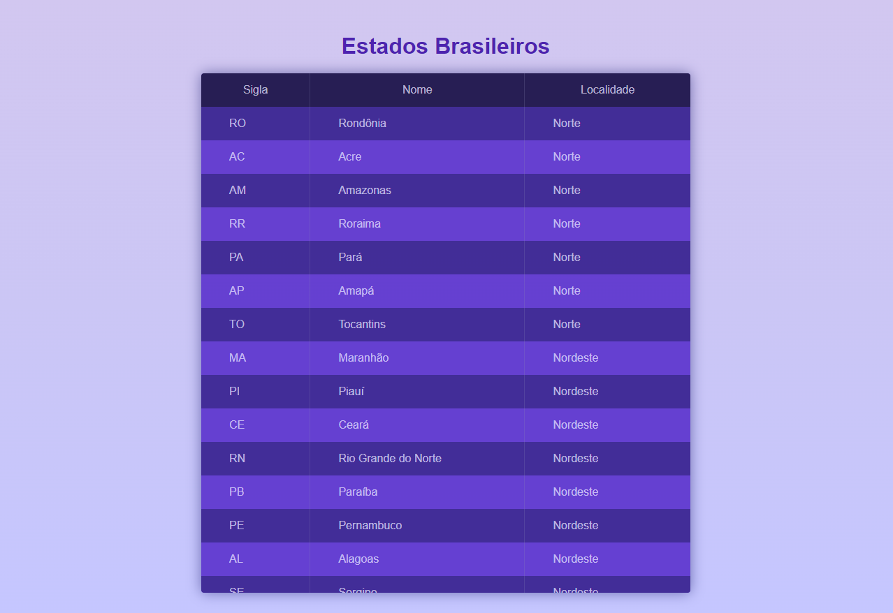

## 🗺 Estados Brasileiros 🗺

**A table with all Brazilian states**

 
 

## 🛠 Technologies used

   

## 🚀 How to start

> clone the repository
<code> git clone https://github.com/LuciLua/EstadosBrasileiros.git</code>

> open project folder
<code> cd ./EstadosBrasileiros</code>

## 🖼 Preview

**So far, this is the preview**

