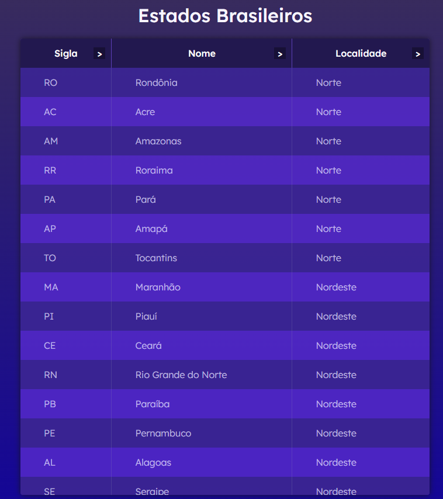

# <p align="center">🗺 Estados Brasileiros 🗺</p>
<p align="center">A table with all Brazilian states</p>
<h1 align="center">
 
  

</br>
</h1>
</br>

## 🛠 Technologies used

   


## 🚀 How to start

> clone the repository
```bash
git clone https://github.com/LuciLua/EstadosBrasileiros.git
```

> open project folder
```bash
cd ./EstadosBrasileiros
```

## 🖼 Preview

**So far, this is the preview**

